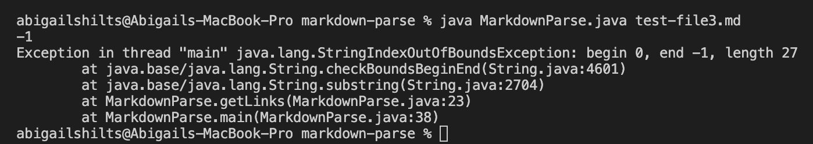
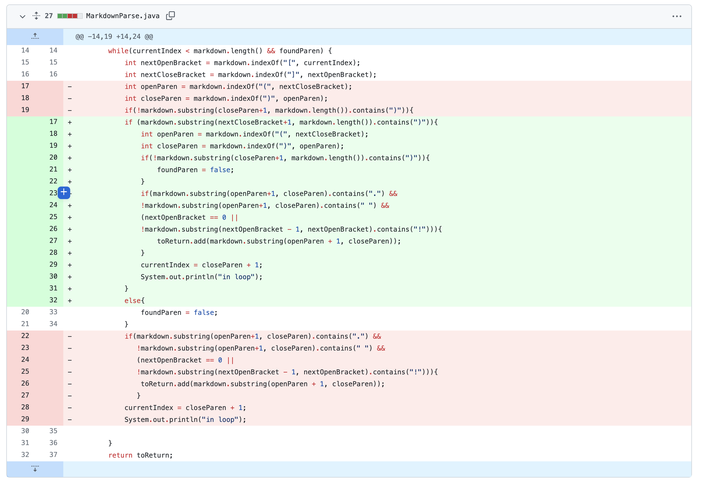

# Week Two and Three Lab Report

[Index page link](https://abigailshilts.github.io/cse15l-lab-reports/)

[first lab report link](https://abigailshilts.github.io/cse15l-lab-reports/lab-report-1-week-2)

## This report is covering Debugging

### _Bug_ 1 - Infinite loop when extra line is at the bottom of the file

[Go here to find the specific test that caused this _symptom_](https://github.com/abigailshilts/markdown-parse-abbi/blob/5b1f7a5b7a70be3e397796f285a626eae257bada/test-extraLine.md)

When the code is run it ends up with this infinite loop output, or _symptom_ (I used `ctrl-c` eventually to exit the loop however the terminal cut off the number of lines so I couldn't scroll back to it so here is a screenshot of the command and one of the output):

To solve we implemented the following changes:

The _bug_ in the program was that it would run so long as the contents of the file being examined were longer than the index of the most recent closing parenthesis +1. This means that any input file that does not end with a closing parenthesis will create the _symptom_ shown above: an infinite loop. Thus to solve for these _failure inducing inputs_ we changed the program to also exit the loop when there are no more closing parenthesis in the file.

## _Bug_ 2 - Out of bounds error when checking for an image tag at the beggining of the file

[Go here to find file that caused this _symptom_](https://github.com/abigailshilts/markdown-parse-abbi/blob/main/newLineAtEnd.md)

When the code is run it will output this error message or _symptom_:

To solve it we implemented these changes:

The _bug_ in this program was that whenever an open bracket was detected it would check the index behind it to see if there was an ! indicating an image tag. However, when the _failure inducing input_ (a file that starts with an open bracket) is passed in the program tries to check for the ! at an index that does not exist. To fix the resulting _symptom_ of an out of bounds exception we used an or statement to shortcircut the ! check by first seeing if the open bracket was at the first index.

## _Bug_ 3 - Out of bounds error when only [] is in the file

[Go here to find file that caused this _symptom_](https://github.com/abigailshilts/markdown-parse-abbi/blob/main/test-file3.md)

The error message or _symptom_ from running this code is:

To solve this I implemented this change:

The _bug_ in this instance was that when the _failure inducing input_ (a file with no open or close parenthesis) was searched, index variables for open and close parenthesis were assigned to -1. Thus when the closeParen index was used to find a substring it caused the _symptom_ of an out of bounds error. To solve this the code now first checks that there are any parenthesis in the rest of the file before assigning those index variables, if there are none then it exits.