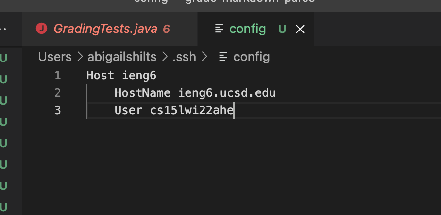
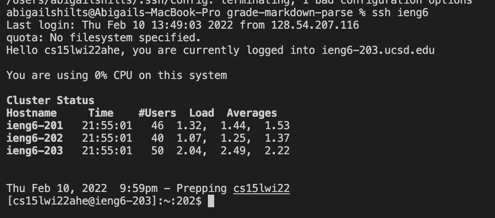
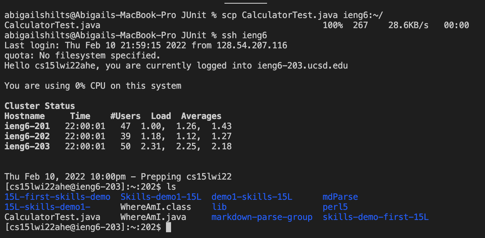

# Week Four and Five Lab Report

[Index page link](https://abigailshilts.github.io/cse15l-lab-reports/)

[first lab report link](https://abigailshilts.github.io/cse15l-lab-reports/lab-report-1-week-2)

[second lab report link](https://abigailshilts.github.io/cse15l-lab-reports/lab-report-2-week-4)

## This report is covering streamlining `ssh` configuration

The goal for this report was to make an alias so writing out the entire cs15....edu to access ieng6 can be shortened to something, I chose ieng6.

The first step was to access the `.ssh/config` file. To do so I typed `code ~/.ssh/config` into a terminal which popped open a vs code window to edit `.ssh/config`. From there I added the following code so now the file looks like this:

Now, since the `.ssh/config` is told to recognize ieng6 as my account for 15L, I can type `ssh ieng6` to enter into my account:

From there it is really easy to use `scp` to transfer files onto the server. All it takes is `scp (filename) ieng6:~/` for example:

