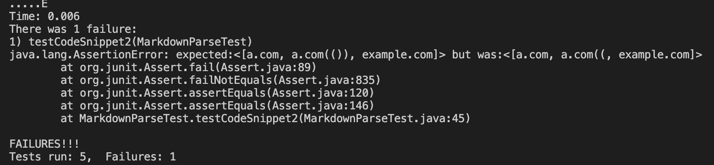
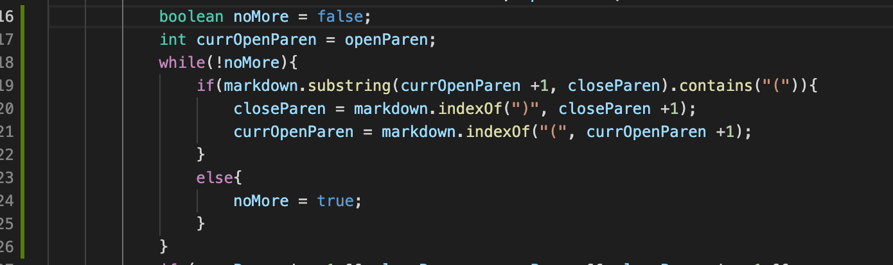
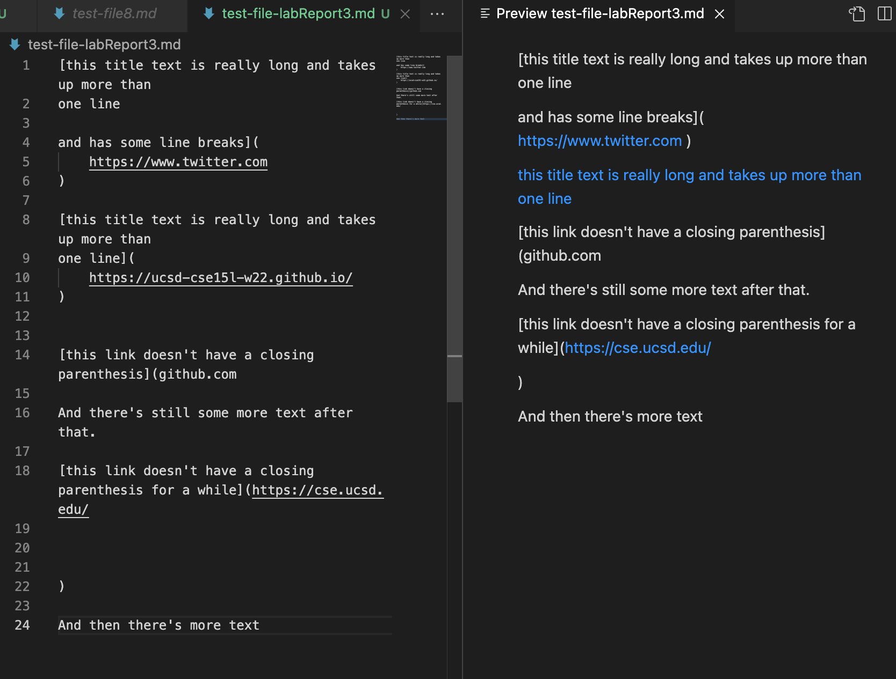
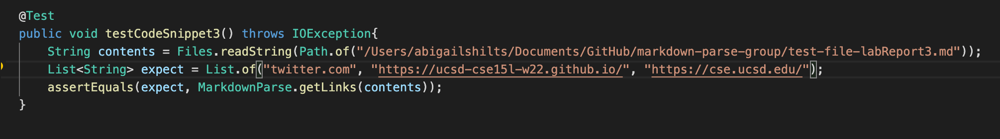
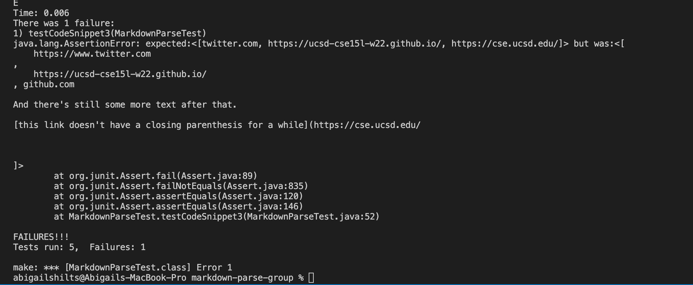
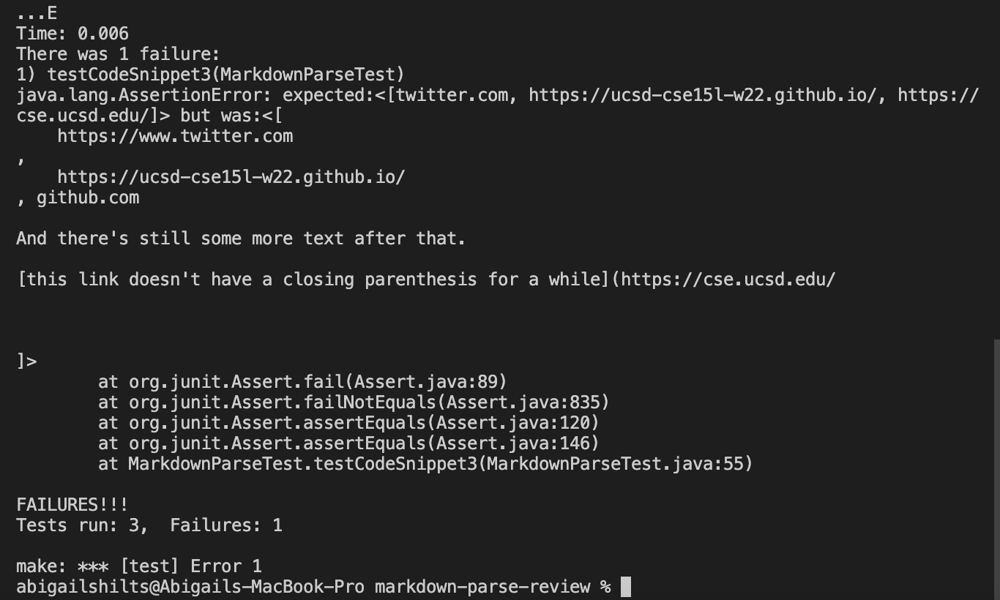

# Week 7 and 8 lab report

[My repository](https://github.com/abigailshilts/markdown-parse-group)
[Reviewed repository](https://github.com/yi113/markdown-parse)

## Code snippet 1:

When the first code snippet is opened in a VScode preview it looks like:

Thus the expected output is [google.com, google.com, ucsd.edu]

To test this I added this test to MarkdownParseTest:

This test failed when run against my version of MarkdownParse with this output:

This test also failed when ran against the version of markdown parse reviewed during my lab with this output:

The fix for this would not be considered a small change. For every new open bracket found tou would need to loop through the substring between the current index and the open bracket to detirmine how many back ticks existed. If it was an even number then you could use the link if not then the link was invalid. However it gets more complex in that you have to check that the backticks occur on the same line as the new open bracket in which case you have more comparisons to detirmine where to begin to check the substring for backticks or where to end it. Each of these loops and comparisons would be more than 3 lines. After that you then also have to remove all back ticks from all valid links which is also another line of code. All together it will end up being >10 lines.

## Code snippet 2

When the second code snippet is opened in VS code preview it looks like this:

Which means that the expected output is [a.com, a.com(()), example.com]

To test this I added this test to MarkdownParseTest:

When ran against my version of MarkdownParse it failed with this output:

When ran against the reviewed repository it failed with this output:

Since my code was able to handle everything except for the nested parenthesis the fix would be just slightly over ten lines. To solve the issue it would take a while loop after assigning the `closeParen` variable to reasign a new `closeParen`. With a pointer to the current open paren the loop will evaluate if there is an additional open paren in the substring between the current pointer and `closeParen`. If there are then the current open paren pointer is moved to the new open paren and the `closeParen` is moved to the next latest occurence of a closing parenthesis.

An example of the change that is being described that allowed the test to run:

## Code snippet 3

When the third code snippet is opened in a VScode preview it looks like:

Thus the expected output is: [twitter.com, https://ucsd-cse15l-w22.github.io/, https://cse.ucsd.edu/]

The test I added to both repos was:

When ran against my code it failed with this output:

The reviewed code failed with this output:

This would be a relativly small change to fix. To solve for this issue in my repo there would need to ba a couple of changes. First when adding the links to `toReturn` the java `replace()` function should be used to replace new line and space characters with empty strings. Then in the if statement before the links are added it should also check that in the substring between the current open parenthesis and the next open bracket (or end of the `markdown` string if there are no more open brackets) contains a close parenthesis.