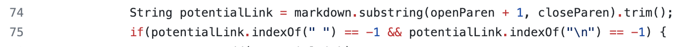

# Week Nine and Ten Lab Report

[Index page link](https://abigailshilts.github.io/cse15l-lab-reports/)

## The differences

The two tests that I am focusing on are test-files/510.md and test-files/494.md. To find that there was a difference between my version of MarkdownParse and hte provided one I moved my version into the folder with the tests and script.sh and added an extra line (pictured below) to the echo that also printed out my versions result to each file in addition to the file name and the provided versions result.

The differences in output are as seen below:

*Note that the provided file's output is on top and my file's output is below

## test-files/510.md
For this test my implementation is actually correct. the contents of this test file is:
> [link] (/uri)

Because of the space between [link] and (/uri) markdown does not recognize this as a link and thus the parsing programs should return an empty list. The provided implementation however returns "/uri".

This issue results largely from two places in the code:

This code merely finds the next open parenthesis after the next close bracket and then pulls the contents inside of it. From there is checks if the contents are a valid link but during this process never checks what/if anything is between the close bracket and open parenthesis. To solve for this bug, somewhere in the code pictured above, there should also be a check that there is nothing invalidating inbetween the close bracket and open parenthesis.

## test-files/494.md
For this test neither implementation is the correct one. The contents of this testfile is:
> [link](\(foo\))

According to common mark this should return a link of "(foo)" which is represented by neither MarkdownParse implementations.

Since both are incorrect I will focus on my version of MarkdownParse. The bug for this spawns from line 31 in the following code:

Since the slashes are not suppossed to be considered in the link they should not included in what is added to the toReturn ArrayList. Instead replace can be called on the substring before it is added to remove any backslashes in the link.

